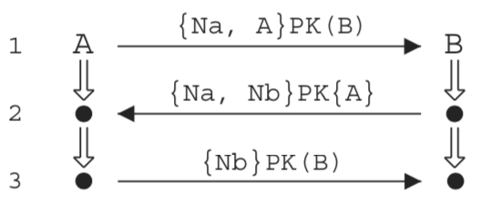

# Using SPIN to Verify Security Properties of Cryptographic Protocols

This repo contains source for the Promela code found in [this
paper](https://link.springer.com/chapter/10.1007/3-540-46017-9_14)
that illustrates use of the [SPIN model
checker](http://spinroot.com/spin/whatispin.html) to reveal flaws in
the [Needham-Shroeder Public Key
Protocol](https://en.wikipedia.org/wiki/Needham%E2%80%93Schroeder_protocol).

## Explanation

This simple example consists of three processes: the *initiator* (PIni
... known as "A" in this example), the *responder* (PRes ... known as "B"
in this example) and the *intruder* (PI) whose specification is found
in the file *ns1.pml*.  The specification is written in Promela.



The *ns1.pml* example uses a reduced model of the protocol in which
the trusted key server is left out.  In the reduced model, it is
assumed that A and B have access to each others' public keys (i.e.,
PK(A) and PK(B)) and private access to their own private keys (i.e.,
SK(A) and SK(B)).  In message 1, A sends a message consisting of a
nonce (Na) and its own identifier (A) to B encrypted with B's public
key: {Na, A}PK(B).  Next, in message 2, B sends a message
acknowledging receipt of the nonce (Na) with its own nonce (Nb) to A
encrypted with A's public key: {Na, Nb}PK(A).  Finally, in message 3,
A sends a message back to B with its nonce (Nb) encrypted with B's
public key: {Nb}PK(B).  In this example, there is an intruder (not
shown) that can intercept messages (aka "man-in-the-middle") and spoof
the initiator or responder.

````
proctype PIni(mtype self; mtype party; mtype nonce)
{
	mtype g1;

	atomic {
	       IniRunning(self,party);
	       ca ! self, nonce, self, party;
	       }

	atomic {
	       ca ? eval(self), eval(nonce), g1, eval(self);
	       IniCommit(self,party);

	       cb ! self, g1, party;
	}
}
````

The initiator (PIni shown above) is run (see the init section in the
ns1.pml file) with self assigned "A", party assigned "B" or "I" and
the nonce assigned "Na".  After setting InitRunningAB to true, the
initiator (A) non-deterministically sends (!) a message to either B or the
Intruder (I) to represent an intercepted message.  The initiator (A)
then waits to receive a message (?).

````
proctype PRes(mtype self; mtype nonce)
{
	mtype g2, g3;

	atomic {
	       ca ? eval(self), g2, g3, eval(self);
	       ResRunning(g3,self);
	       ca ! self, g2, nonce, g3;
	}
	atomic {
	       cb ? eval(self), eval(nonce), eval(self);
	       ResCommit(g3,self);
	}
}
````

The responder (B) waits to receive (?) a message from either A or the
Intruder.  When it receives a message, it sets its state to
ResRunningAB = true and then replies (!) with a message to the sender.
The responder (B) then waits (?) to receive a commit message (from A
or the Intruder).


The sequence diagram above illustrates one possible trace in which a
flaw found automatically by SPIN in the protocol.  This flaw was first
identified by [Lowe](http://web.comlab.ox.ac.uk/oucl/work/gavin.lowe/Security/Papers/NSPKP.ps).
Indeed, 23 variants are found automatically due to random
interleavings of the different processes.  In this trace (called a
"trail" in SPIN), the Linear Temporal Logic (LTL) property:

<center>ltl ltl_1 { [] ( ([] !ResCommitAB) || (!ResCommitAB U IniRunningAB) ) }</center>

is violated in this sequence.  This LTL clause can be interpreted as
*it is always the case in any trace that EITHER the responder will
always NOT commit ([]!ResCommitAB) OR the responder will not commit
(!ResCommitAB) UNTIL AFTER the initiator runs* (IniRunningAB).  The
violation occurs in this trace because the initiator is running
(IniRunningAB) but the responder never commits (ResCommitAB) in *ANY*
future.  The 2nd part of the LTL clause is powerful because it says
that the responder must eventually become true UNTIL AFTER (U) the
initiator runs (which is set after it sends its message).

## Installation

1. [Download, build and install SPIN on your machine](http://spinroot.com/spin/Man/README.html)

2. Clone this repo

3. Change into the needham_shroeder_spin directory

4. Search for errors using the first Linear Temporal Logic (LTL) Formula (ltl_0).  There should be no errors:

````
% spin -search -ltl ltl_0 ns1.pml

pan: ltl formula ltl_0

(Spin Version 6.5.0 -- 17 July 2019)
	+ Partial Order Reduction

Full statespace search for:
	never claim         	+ (ltl_0)
	assertion violations	+ (if within scope of claim)
	acceptance   cycles 	+ (fairness disabled)
	invalid end states	- (disabled by never claim)

State-vector 72 byte, depth reached 30, errors: 0
      381 states, stored
      814 states, matched
     1195 transitions (= stored+matched)
     2325 atomic steps
hash conflicts:         0 (resolved)

Stats on memory usage (in Megabytes):
    0.036	equivalent memory usage for states (stored*(State-vector + overhead))
    0.266	actual memory usage for states
  128.000	memory used for hash table (-w24)
    0.534	memory used for DFS stack (-m10000)
  128.730	total actual memory usage


unreached in proctype PIni
	(0 of 18 states)
unreached in proctype PRes
	(0 of 18 states)
unreached in proctype PI
	ns1.pml:136, state 84, "-end-"
	(1 of 84 states)
unreached in init
	(0 of 8 states)
unreached in claim ltl_0
	_spin_nvr.tmp:11, state 20, "(!(ResRunningAB))"
	_spin_nvr.tmp:11, state 20, "((!(!(IniCommitAB))&&!(ResRunningAB)))"
	_spin_nvr.tmp:16, state 28, "(!(!(IniCommitAB)))"
	_spin_nvr.tmp:16, state 28, "(1)"
	_spin_nvr.tmp:28, state 48, "(!(!(IniCommitAB)))"
	_spin_nvr.tmp:28, state 48, "(1)"
	_spin_nvr.tmp:33, state 52, "-end-"
	(4 of 52 states)

pan: elapsed time 0.01 seconds
ltl ltl_0: [] (([] (! (IniCommitAB))) || ((! (IniCommitAB)) U (ResRunningAB)))
ltl ltl_1: [] (([] (! (ResCommitAB))) || ((! (ResCommitAB)) U (IniRunningAB)))
  the model contains 2 never claims: ltl_1, ltl_0
  only one claim is used in a verification run
  choose which one with ./pan -a -N name (defaults to -N ltl_0)
  or use e.g.: spin -search -ltl ltl_0 ns1.pml
````

5. Search for errors using the second Linear Temporal Logic Formula (ltl_1).  There should be at least 1 error:

````
% spin -search -ltl ltl_1 ns1.pml

pan: ltl formula ltl_1
pan:1: acceptance cycle (at depth 28)
pan: wrote ns1.pml.trail

(Spin Version 6.5.0 -- 17 July 2019)
Warning: Search not completed
	+ Partial Order Reduction

Full statespace search for:
	never claim         	+ (ltl_1)
	assertion violations	+ (if within scope of claim)
	acceptance   cycles 	+ (fairness disabled)
	invalid end states	- (disabled by never claim)

State-vector 72 byte, depth reached 30, errors: 1
      152 states, stored
      180 states, matched
      332 transitions (= stored+matched)
      662 atomic steps
hash conflicts:         0 (resolved)

Stats on memory usage (in Megabytes):
    0.014	equivalent memory usage for states (stored*(State-vector + overhead))
    0.266	actual memory usage for states
  128.000	memory used for hash table (-w24)
    0.534	memory used for DFS stack (-m10000)
  128.730	total actual memory usage


pan: elapsed time 0 seconds
ltl ltl_0: [] (([] (! (IniCommitAB))) || ((! (IniCommitAB)) U (ResRunningAB)))
ltl ltl_1: [] (([] (! (ResCommitAB))) || ((! (ResCommitAB)) U (IniRunningAB)))
  the model contains 2 never claims: ltl_1, ltl_0
  only one claim is used in a verification run
  choose which one with ./pan -a -N name (defaults to -N ltl_0)
  or use e.g.: spin -search -ltl ltl_0 ns1.pml
````

6. Generate trail files for ALL error variants (23 of them):

````
% ./pan -a -e -N ltl_1

pan: ltl formula ltl_1
pan:1: acceptance cycle (at depth 28)
pan: wrote ns1.pml1.trail
pan:2: assertion violated  !(( !( !(ResCommitAB))&& !(IniRunningAB))) (at depth 28)
pan: wrote ns1.pml2.trail
pan:3: acceptance cycle (at depth 28)
pan: wrote ns1.pml3.trail
pan: wrote ns1.pml4.trail
pan:5: assertion violated  !(( !( !(ResCommitAB))&& !(IniRunningAB))) (at depth 28)
pan: wrote ns1.pml5.trail
pan:6: acceptance cycle (at depth 28)
pan: wrote ns1.pml6.trail
pan:7: assertion violated  !(( !( !(ResCommitAB))&& !(IniRunningAB))) (at depth 27)
pan: wrote ns1.pml7.trail
pan: wrote ns1.pml8.trail
pan: wrote ns1.pml9.trail
pan:10: assertion violated  !( !( !(ResCommitAB))) (at depth 28)
pan: wrote ns1.pml10.trail
pan:11: acceptance cycle (at depth 28)
pan: wrote ns1.pml11.trail
pan:12: assertion violated  !( !( !(ResCommitAB))) (at depth 29)
pan: wrote ns1.pml12.trail
pan: wrote ns1.pml13.trail
pan:14: acceptance cycle (at depth 28)
pan: wrote ns1.pml14.trail
pan:15: assertion violated  !( !( !(ResCommitAB))) (at depth 29)
pan: wrote ns1.pml15.trail
pan:16: assertion violated  !(( !( !(ResCommitAB))&& !(IniRunningAB))) (at depth 27)
pan: wrote ns1.pml16.trail
pan:17: assertion violated  !( !( !(ResCommitAB))) (at depth 27)
pan: wrote ns1.pml17.trail
pan:18: assertion violated  !(( !( !(ResCommitAB))&& !(IniRunningAB))) (at depth 27)
pan: wrote ns1.pml18.trail
pan: wrote ns1.pml19.trail
pan: wrote ns1.pml20.trail
pan: wrote ns1.pml21.trail
pan:22: assertion violated  !( !( !(ResCommitAB))) (at depth 27)
pan: wrote ns1.pml22.trail
pan:23: assertion violated  !(( !( !(ResCommitAB))&& !(IniRunningAB))) (at depth 27)
pan: wrote ns1.pml23.trail

(Spin Version 6.5.0 -- 17 July 2019)
	+ Partial Order Reduction

Full statespace search for:
	never claim         	+ (ltl_1)
	assertion violations	+ (if within scope of claim)
	acceptance   cycles 	+ (fairness disabled)
	invalid end states	- (disabled by never claim)

State-vector 72 byte, depth reached 30, errors: 23
      385 states, stored (388 visited)
      935 states, matched
     1323 transitions (= visited+matched)
     2423 atomic steps
hash conflicts:         0 (resolved)

Stats on memory usage (in Megabytes):
    0.037	equivalent memory usage for states (stored*(State-vector + overhead))
    0.266	actual memory usage for states
  128.000	memory used for hash table (-w24)
    0.534	memory used for DFS stack (-m10000)
  128.730	total actual memory usage


unreached in proctype PIni
	(0 of 18 states)
unreached in proctype PRes
	(0 of 18 states)
unreached in proctype PI
	ns1.pml:136, state 84, "-end-"
	(1 of 84 states)
unreached in init
	(0 of 8 states)
unreached in claim ltl_1
	_spin_nvr.tmp:67, state 52, "-end-"
	(1 of 52 states)

pan: elapsed time 0.01 seconds
````

7. Examine the trail of the first error found:

````
% spin -c ns1.pml -k ns1.pml.trail

proc 0 = :init:
ltl ltl_0: [] (([] (! (IniCommitAB))) || ((! (IniCommitAB)) U (ResRunningAB)))
ltl ltl_1: [] (([] (! (ResCommitAB))) || ((! (ResCommitAB)) U (IniRunningAB)))
proc 1 = PIni
proc 2 = PRes
proc 3 = PI
q\p   0   1   2   3
  1   .   ca!A,Na,A,B
  1   .   .   .   ca?0,Na,A,B
  1   .   .   .   ca!B,B,A,B
  1   .   .   ca?B,B,A,B
  1   .   .   ca!B,B,Nb,A
  1   .   .   .   ca?0,B,Nb,A
      timeout
-------------
final state:
-------------
#processes: 4
		IniRunningAB = 1
		IniCommitAB = 0
		ResRunningAB = 1
		ResCommitAB = 0
 23:	proc  3 (PI:1) ns1.pml:92 (state 81)
 23:	proc  2 (PRes:1) ns1.pml:73 (state 10)
 23:	proc  1 (PIni:1) ns1.pml:56 (state 9)
 23:	proc  0 (:init::1) ns1.pml:147 (state 8) <valid end state>
4 processes created
````

8. Examine the trail of the second error found:

````
% spin -c ns1.pml -k ns1.pml1.trail

proc 0 = :init:
ltl ltl_0: [] (([] (! (IniCommitAB))) || ((! (IniCommitAB)) U (ResRunningAB)))
ltl ltl_1: [] (([] (! (ResCommitAB))) || ((! (ResCommitAB)) U (IniRunningAB)))
proc 1 = PIni
proc 2 = PRes
proc 3 = PI
q\p   0   1   2   3
  1   .   .   .   ca!B,gD,I,B
  1   .   .   ca?B,gD,I,B
  1   .   .   ca!B,gD,Nb,I
  1   .   .   .   ca?0,gD,Nb,I
  2   .   .   .   cb!B,Nb,B
  2   .   .   cb?B,Nb,B
  1   .   ca!A,Na,A,B
  1   .   .   .   ca?0,Na,A,B
      timeout
-------------
final state:
-------------
#processes: 4
		IniRunningAB = 1
		IniCommitAB = 0
		ResRunningAB = 0
		ResCommitAB = 0
 28:	proc  3 (PI:1) ns1.pml:92 (state 81)
 28:	proc  2 (PRes:1) ns1.pml:76 (state 18) <valid end state>
 28:	proc  1 (PIni:1) ns1.pml:56 (state 9)
 28:	proc  0 (:init::1) ns1.pml:147 (state 8) <valid end state>
4 processes created
````

9. Examine the trail of the THIRD error found:

````
% spin -c ns1.pml -k ns1.pml2.trail

proc 0 = :init:
ltl ltl_0: [] (([] (! (IniCommitAB))) || ((! (IniCommitAB)) U (ResRunningAB)))
ltl ltl_1: [] (([] (! (ResCommitAB))) || ((! (ResCommitAB)) U (IniRunningAB)))
proc 1 = PIni
proc 2 = PRes
proc 3 = PI
q\p   0   1   2   3
  1   .   .   .   ca!B,gD,A,B
  1   .   .   ca?B,gD,A,B
  1   .   .   ca!B,gD,Nb,A
  1   .   .   .   ca?0,gD,Nb,A
  1   .   ca!A,Na,A,I
  1   .   .   .   ca?0,Na,A,I
  1   .   .   .   ca!A,Na,Na,A
  1   .   ca?A,Na,Na,A
  2   .   cb!A,Na,I
  2   .   .   .   cb?0,Na,I
      timeout
-------------
final state:
-------------
#processes: 4
		IniRunningAB = 0
		IniCommitAB = 0
		ResRunningAB = 1
		ResCommitAB = 0
 34:	proc  3 (PI:1) ns1.pml:92 (state 81)
 34:	proc  2 (PRes:1) ns1.pml:73 (state 10)
 34:	proc  1 (PIni:1) ns1.pml:61 (state 18) <valid end state>
 34:	proc  0 (:init::1) ns1.pml:147 (state 8) <valid end state>
4 processes created
````

10. Rinse and repeat


